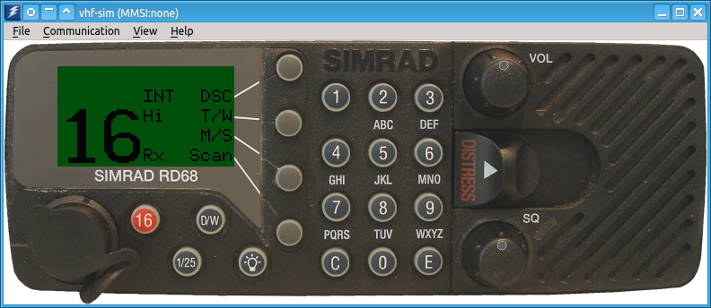

# VHF-Sim

Copyright (c) 2016 Mario Konrad (mario.konrad@gmx.net)

Simulates a VHF radio for maritime navigation. The purpose of this software
to learn and practice the handling of radio infrastructure, usually found
on pleasure crafts.

It is also useful for SRC exams.

**Note:** this is direct successor of the old implementation from 2007. The old
      version was implemented in wxWidgets-2.8.12 and OpenAL. The current
      software is not a complete overhaul, but merely a port with minor
      refactoring.
      There is however, no guarantee of compatibility.

## Usage

The VHF simulator has one main window, showing the simulated VHF and a menu.
Use the buttons shown on the simulation to use it. If it is unclear where
usable areas are, use the menu `View / Show Buttons` to reveal all existing
buttons.

### Menu

- `File / VHF Preferences`
  : general configuration of the simulator
- `File / GPS`
  : a primitive GPS simulation to feed static positional information
    to the VHF simulation
- `File / Exam Mode`
  : toggles between normal mode and exam mode. In exam mode, the VHF simulation
    behaves slighly different, for example distress alerts are not being sent
    every 5 minutes. This is particularly useful in an exam situation for the SRC.
- `Communication / Control Center`
  : simulates a communication peer, to receive and confirm DSC calls sent by the
    simulation. Also able to call the simulation. This is a very rudimentary
    simulation of a sea or shore station and is useful to learn how the VHF
    simlator behaves in DSC mode.
- `Communication / Connection Preferences`
  : configuration dialog for communication over TCP to a communications hub.
- `Communication / Open Connection`
  : Opens a configured communication to the communications hub.
- `Communication / Close Connection`
  : closes an open communication channel.
- `Communication / Communications Hub`
  : control of a communications hub. Useful if you like to use two or more VHF
    simulators at the same time, either local or over a network. The communication
    is TCP based. This is useful if you like to learn how the simulation behaves
    with DSC calls of all types in conjunction with other sea stations. Only one
    enabled communications hub is necessary to use this feature.
- `View / Fullscreen`
  : toggles between window mode and fullscreen
- `View / Show Buttons`
  : reveals all buttons of the simulation. All areas usable by the mouse will
    be highlighted in red color.
- `Help / About`
  : information about the simulation
- `Help / About Qt`
  : information about Qt

### Keyboard

It is possible to use the computer keyboard, following keys are defined:

| Key            | Function within the Simulator |
|----------------|-------------------------------|
| 0 ..9          | 0 .. 9                        |
| F1 .. F4       | Soft 1 .. Soft 4              |
| RETURN         | E                             |
| ENTER (numpad) | E                             |
| ESC            | C                             |

### Commandline Parameters

~~~
--mmsi MMSI : defines a non-modifyable MMSI for the VHF instance
~~~

## License

See file [LICENSE](License)

## Technical

Following tools are being used:
- Compiler: GCC 4.9 / 5.3
- Source Control: git
- Build System: cmake 3.2
- clang-format-3.7
- Qt 5.5
- Lua 5.1.1

